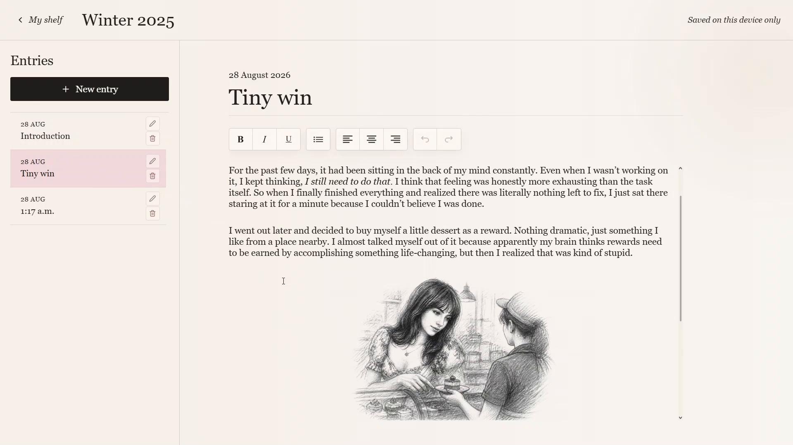
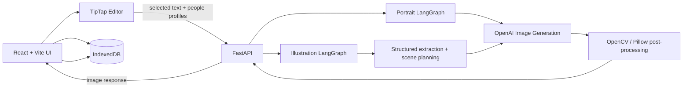
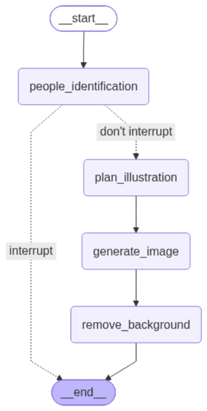
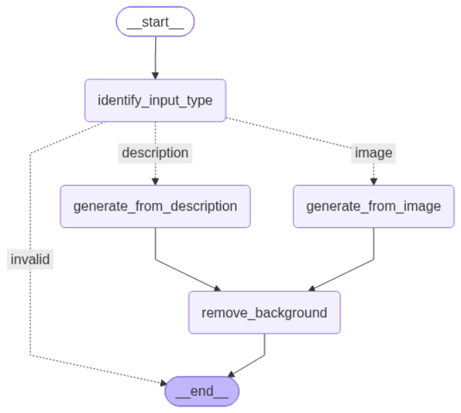
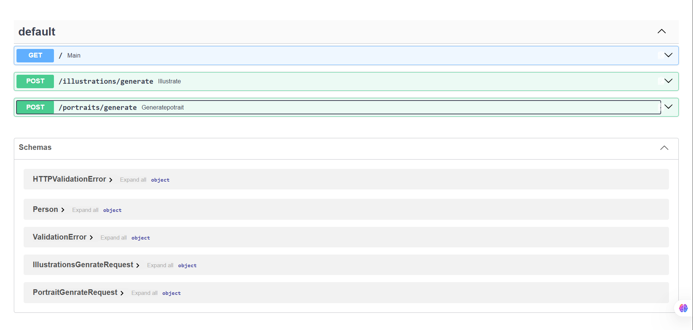

# Dear Diary

**An identity-aware AI visual journaling app that turns written memories into personalized graphite illustrations.**

Dear Diary is a full-stack portfolio project that combines a rich-text diary experience with persistent person profiles and two AI workflows. A user can write normally, save the people who appear in their life, select a moment from an entry, and generate an illustration that uses those saved identities as references.

<p align="center">
  <a href="https://dear-diary-lemon.vercel.app"><strong>Live Demo</strong></a>
  &nbsp;•&nbsp;
  <a href="https://dear-diary-q3qr.onrender.com/docs"><strong>API Docs</strong></a>
</p>

<p align="center">
  
</p>

> Diary data is stored locally in the browser with IndexedDB. The backend is used for AI portrait and illustration generation rather than as a server-side application database.

## Demo

The project demo has been combined into one video showing the editor illustration flow and portrait generation flow.

<p align="center">
  <a href="docs/media/demo.mp4">
    
  </a>
</p>

<p align="center">
  <a href="docs/media/demo.mp4"><strong>▶ Watch the full demo video</strong></a>
</p>

## What it does

- Create and customize multiple diaries.
- Write rich-text diary entries with TipTap.
- Create persistent profiles for people who appear in entries.
- Mark a saved profile as the diary owner so first-person references can resolve correctly.
- Generate a graphite-style portrait from either a written appearance description or an uploaded reference image.
- Select part of a diary entry and generate an illustration directly inside the editor.
- Identify which saved people are physically present in the selected moment before image generation.
- Stop the illustration workflow early when a required person is missing a usable portrait.
- Store diary data and generated image Blobs locally with IndexedDB.
- Export the full local application state to JSON and restore it later through backup import.

## Technical architecture



The frontend and backend are intentionally separated. React handles the diary interface, TipTap editor state, and browser-local persistence, while FastAPI exposes the AI endpoints and invokes the LangGraph workflows.

## Illustration workflow

<p align="center">
  
</p>

The illustration pipeline does more than forward selected text to an image model. It first identifies who is physically present in the moment, checks whether the required identities are available, and only continues to the image-generation stage when the scene has enough information.

```text
people_identification
        ↓
conditional missing-person check
        ↓
plan_illustration
        ↓
generate_image
        ↓
remove_background
```

If a required person is unavailable, the graph exits before the expensive image-generation step and the frontend can ask the user to add the missing person or portrait.

When the required references are available, the planning node reduces the selected journal text to a concise visual scene. The generation step uses the relevant identity references and the project's graphite-style reference, then the returned image is post-processed before being sent back to the editor.

## Portrait workflow

<p align="center">
  
</p>

Portrait generation supports two routes:

- **Description route:** generate a portrait from a written physical description.
- **Image route:** generate a portrait using an uploaded identity reference.

The graph first identifies the supplied input type, routes to the correct generation branch, and sends successful results through the shared background-removal step. Invalid input exits without generation.

## Frontend and editor integration

TipTap is extended with a custom illustration node so generated media becomes part of the diary document rather than a separate gallery item. The node manages its own loading, success, regeneration, deletion, missing-person, and general error UI states.

Generated portraits and diary illustrations are stored as `Blob` objects in browser-local data. When image data must cross the JSON API boundary, the frontend converts it to a Base64 data URL and the backend reconstructs the image before passing it to the AI workflow.

## Local-first persistence and backup

Dear Diary currently requires no account and no application database on the server.

IndexedDB stores the persistent browser state, including diaries, entries, TipTap JSON, person profiles, uploaded reference photos, generated portraits, and generated illustrations.

Because JSON cannot directly represent `Blob` objects, the backup system recursively serializes Blobs into Base64-tagged objects during export. Import performs the reverse traversal and reconstructs the original Blob values before restoring the application state.

## Interface

<table>
  <tr>
    <td width="50%"></td>
    <td width="50%"></td>
  </tr>
  <tr>
    <td align="center"><strong>My Shelf</strong></td>
    <td align="center"><strong>Create a diary</strong></td>
  </tr>
  <tr>
    <td width="50%"></td>
    <td width="50%"></td>
  </tr>
  <tr>
    <td align="center"><strong>Person profiles and portrait generation</strong></td>
    <td align="center"><strong>How it works</strong></td>
  </tr>
</table>

## API

<p align="center">
  
</p>

| Method | Endpoint | Purpose |
| --- | --- | --- |
| `GET` | `/` | Health/root endpoint |
| `POST` | `/illustrations/generate` | Identify people, plan the selected moment, and generate a diary illustration |
| `POST` | `/portraits/generate` | Generate a portrait from a description or reference image |

FastAPI uses Pydantic request models for validation and returns generated image responses to the frontend.

## Tech stack

| Layer | Technologies |
| --- | --- |
| Frontend | React, Vite, JavaScript, TipTap, React Icons |
| Browser persistence | IndexedDB, Blob storage, Base64 backup serialization |
| Backend | Python, FastAPI, Pydantic, Uvicorn |
| AI orchestration | LangGraph, LangChain OpenAI, structured outputs |
| Image generation | OpenAI image generation/editing |
| Image processing | OpenCV, NumPy, Pillow |
| Deployment | Vercel frontend, Render backend |

## Key engineering challenges

- **Identity-aware generation:** resolving names and first-person references in free-form journal text against persistent people profiles.
- **Conditional graph routing:** preventing unnecessary image calls when required identity information is missing.
- **Scene extraction:** separating visually useful information from dialogue, explanations, memories, and people who are only mentioned.
- **Reference-conditioned image generation:** combining identity references with a consistent sketch style while still allowing scene-specific poses and composition.
- **Rich-text AI integration:** inserting generated images as custom TipTap nodes and keeping their UI state synchronized with the document.
- **Blob persistence:** storing generated image data directly inside browser-local application state.
- **Portable backups:** recursively translating nested Blob values to JSON-compatible Base64 data and reconstructing them on import.
- **Frontend/backend image transport:** moving image data through JSON requests and image responses without adding a server-side media database.

## Repository structure

```text
Dear-Diary/
├── backend/
│   ├── agents/
│   │   ├── generate_illustration_agent.py
│   │   ├── generate_portrait_agent.py
│   │   └── inspo.jpeg
│   ├── main.py
│   ├── schemas.py
│   ├── settings.py
│   └── requirements.txt
├── frontend/
│   ├── public/
│   ├── src/
│   │   ├── components/
│   │   ├── pages/
│   │   ├── App.jsx
│   │   ├── database.js
│   │   └── utils.js
│   └── package.json
├── docs/
│   └── media/
└── README.md
```

## README media files

The README expects its screenshots, graph exports, and demo under `docs/media/`:

```text
docs/
└── media/
    ├── app-home.png
    ├── app-shelf.png
    ├── create-diary.png
    ├── add-person.png
    ├── how-it-works.png
    ├── demo-preview.png
    ├── demo.mp4
    ├── illustration-agent-graph.png
    ├── portrait-agent-graph.png
    └── api-docs.png
```

The two graph files in this package are cropped from the supplied VS Code screenshots so the README shows the graph itself rather than the surrounding editor window. `demo-preview.png` is taken from the merged demo video and links to `demo.mp4`.

## Run locally

### Backend

```bash
cd backend
python -m venv venv

# Windows
venv\Scripts\activate

pip install -r requirements.txt
```

Create `backend/.env`:

```env
OPENAI_API_KEY=your_openai_api_key
```

Start the API:

```bash
uvicorn main:app --reload
```

### Frontend

```bash
cd frontend
npm install
npm run dev
```

Set the backend URL for Vite when needed:

```env
VITE_API_URL=http://127.0.0.1:8000
```

## Deployment

- **Frontend:** Vercel
- **Backend:** Render

The production frontend reads the backend URL from `VITE_API_URL`. On the Render free tier, the first request after inactivity may take longer while the backend wakes up.

## Author

**Bushra Magdy**

Computer Science & Engineering student.
