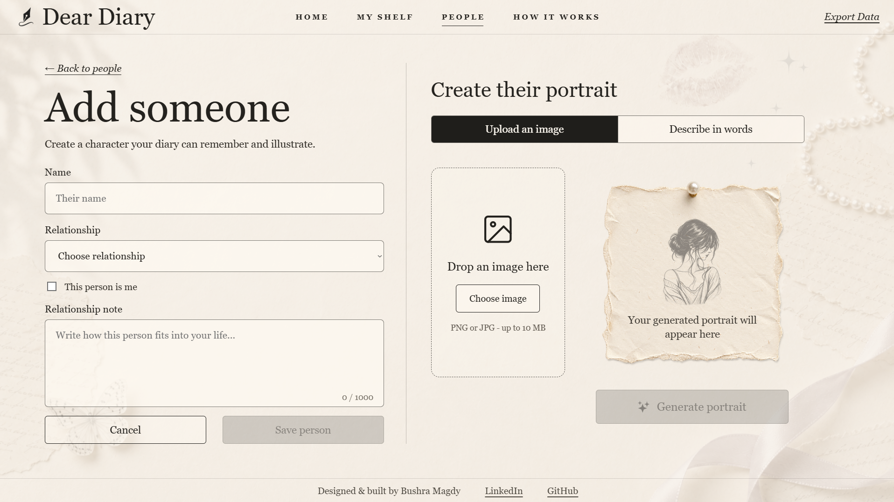
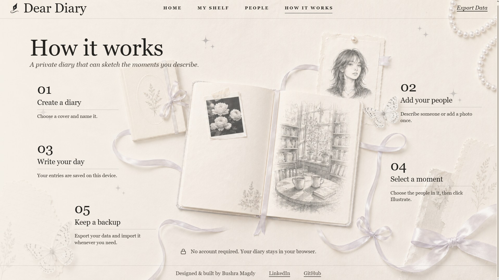
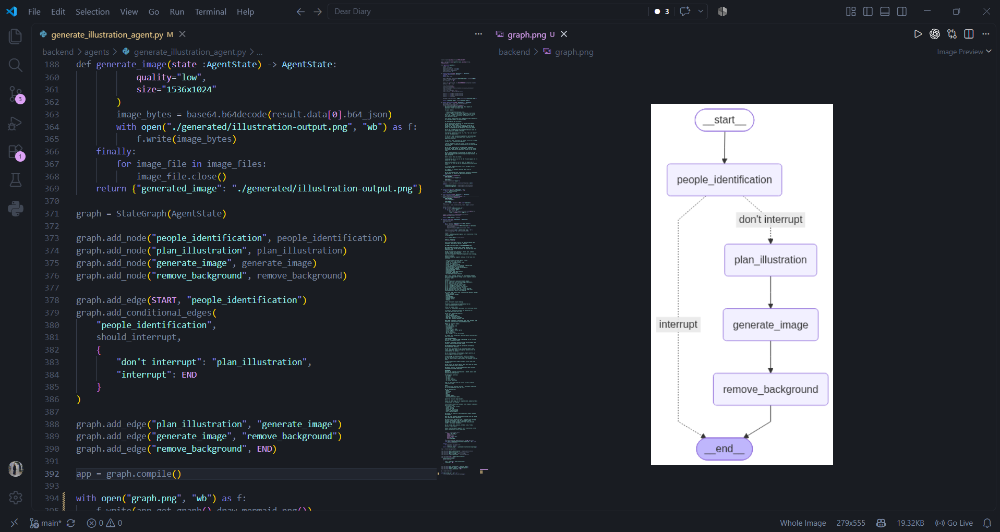
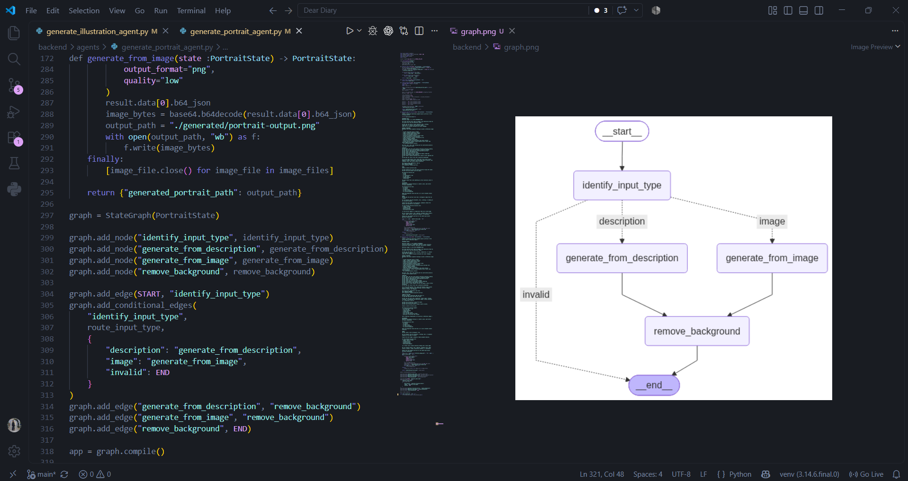

# Dear Diary

Dear Diary is an **AI-powered full-stack portfolio project for journaling**. It combines a rich-text diary experience, persistent people profiles, and two AI workflows for portraits and diary illustrations.

A user can write normally, save the people who appear in their life, select a moment from an entry, and generate an illustration that uses those saved identities as references.

## Interface

The frontend is built with **React, Vite, JavaScript, and TipTap**. Users can create and customize diaries, write rich-text entries, save people profiles, generate portraits, and illustrate selected moments directly inside an entry.

  

<table>
  <tr>
    <td width="50%"></td>
    <td width="50%"></td>
  </tr>
  <tr>
    <td align="center"><strong>My Shelf</strong></td>
    <td align="center"><strong>Create a diary</strong></td>
  </tr>
  <tr>
    <td width="50%"></td>
    <td width="50%"></td>
  </tr>
  <tr>
    <td align="center"><strong>People profiles</strong></td>
    <td align="center"><strong>How it works</strong></td>
  </tr>
</table>

## Local Data & Backup

Dear Diary is local-first. Diaries, entries, TipTap document JSON, people profiles, uploaded reference photos, generated portraits, and generated illustrations are stored in the browser with **IndexedDB** rather than a server-side application database.

Because IndexedDB can store `Blob` objects directly while JSON cannot, the export system recursively converts stored Blobs into Base64 data before downloading one JSON backup file. Import performs the reverse conversion and restores the saved application data.

This keeps the diary usable without an account while still giving the user a way to move or restore their data.

## AI Workflows

The AI backend is built with **Python and FastAPI**, with **Pydantic** models validating the API data. The AI logic is organized as two separate **LangGraph** workflows.

### Illustration Workflow

  

When a user selects part of a diary entry and chooses to illustrate it, the selected text and saved people profiles are sent to the illustration workflow.

The workflow first identifies which saved people are physically present in the selected moment using structured AI output. If a required person is missing a usable portrait, the graph stops before the image-generation step and returns the missing person information to the frontend.

If the required identities are available, the workflow plans a concise visual version of the selected moment and sends the scene together with the relevant identity references and the fixed drawing-style reference to **GPT Image 2**. The generated image is then post-processed with **OpenCV, NumPy, and Pillow** before it is returned to the custom TipTap image node and persisted with the diary entry.

### Portrait Workflow

  

People profiles can be given a generated portrait in two ways: by describing the person's appearance or by uploading a reference image.

The portrait LangGraph workflow identifies which input type was provided, routes to the correct generation branch, generates the portrait with **GPT Image 2**, and runs the same image post-processing stage before returning the result to the frontend.

## Identity-Aware Illustration

People are not treated as anonymous prompt text. Each saved person has a persistent profile and portrait that can be used as an identity reference during illustration generation.

One profile can also represent the **user themself**. This allows the AI to resolve first-person references such as **“I,” “me,” and “my”** to the correct saved identity when the diary owner is actually part of the selected scene.

The demo below shows the full flow, including how the illustration workflow identifies people from the diary text and uses their saved identities when generating the scene.

## Demo

<!-- Drag docs/media/demo.mp4 into this spot using GitHub's README web editor. -->

## Deployment

The frontend is deployed on **Vercel**, while the **FastAPI** backend and AI workflows are deployed on **Render**.

- **Live app:** https://dear-diary-lemon.vercel.app
- **Backend API:** https://dear-diary-q3qr.onrender.com

## Author

**Bushra Magdy**  
Computer Science & Engineering student.
